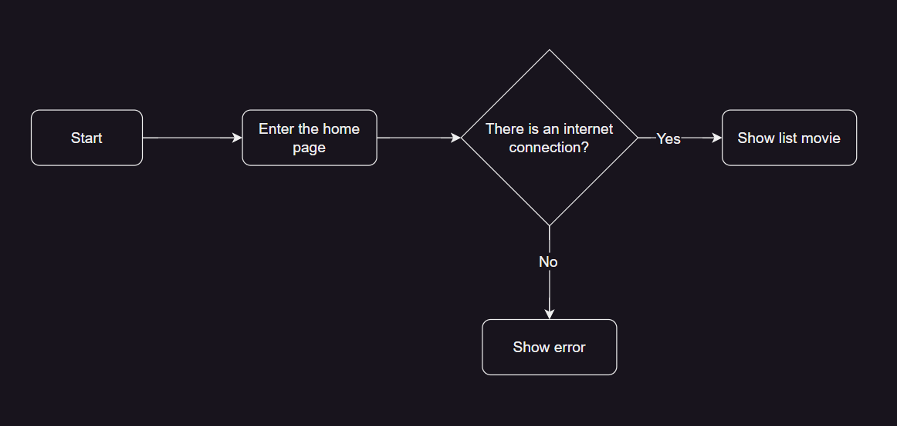
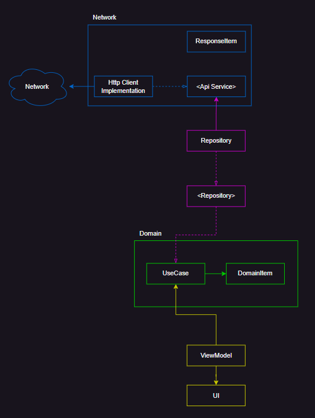

# HighTech Case Study

## Movie List Feature Specs

## BDD Specs

### Story: User requests to see now playing movies

### Narrative

```
As an online user
I want the app to automatically load now playing movies
So I can always enjoy the newest load now playing movies
```

#### Scenarios (Acceptance criteria)

```
Given the user has connectivity
When the user requests to see now playing movies
Then the app should display the latest now playing movies from remote
```

## Use Cases

### Load Movie Now Playing From Remote Use Case

#### Data:
- URL

#### Primary course (happy path):
1. Execute "Load Movie Now Playing" command with above data.
2. System downloads data from the URL.
3. System validates downloaded data.
4. System creates Movie Now Playing from valid data.
5. System delivers Movie Now Playing.

#### Invalid data – error course (sad path):
1. System delivers invalid data error.

#### No connectivity – error course (sad path):
1. System delivers connectivity error.

---

## Flowchart


---

## App Architecture


## Model Specs

### Movie Now Playing

| Property  | Type          |
|-----------|---------------|
| `id`      | `int`         |
| `title` 	 | `string`    	 |
| `poster_path` 	 | `string`    	 |
| `backdrop_path` 	 | `string`    	 |
| `release_date` 	 | `string`    	 |
| `overview` 	 | `string`    	 |
| `vote_average` 	 | `double`    	 |

### Payload contract

```
GET /movie/now_playing

200 RESPONSE

{
  "page": 1,
  "results": [
    {
      "poster_path": "/e1mjopzAS2KNsvpbpahQ1a6SkSn.jpg",
      "adult": false,
      "overview": "From DC Comics comes the Suicide Squad, an antihero team of incarcerated supervillains who act as deniable assets for the United States government, undertaking high-risk black ops missions in exchange for commuted prison sentences.",
      "release_date": "2016-08-03",
      "genre_ids": [
        14,
        28,
        80
      ],
      "id": 297761,
      "original_title": "Suicide Squad",
      "original_language": "en",
      "title": "Suicide Squad",
      "backdrop_path": "/ndlQ2Cuc3cjTL7lTynw6I4boP4S.jpg",
      "popularity": 48.261451,
      "vote_count": 1466,
      "video": false,
      "vote_average": 5.91
    }
  ],
  "dates": {
    "maximum": "2016-09-01",
    "minimum": "2016-07-21"
  },
  "total_pages": 33,
  "total_results": 649
}
```